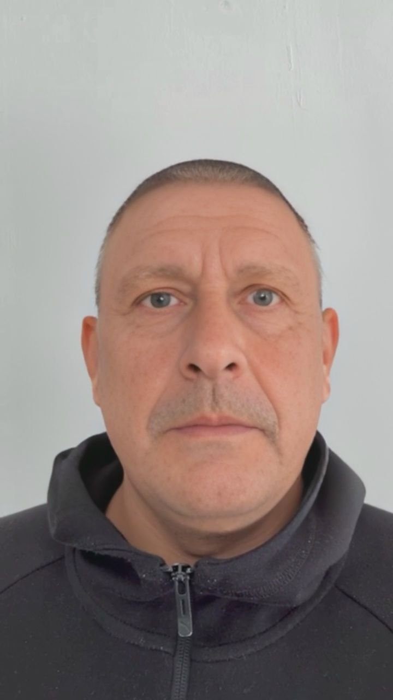
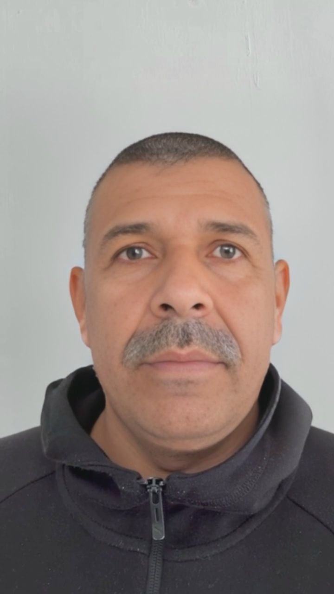
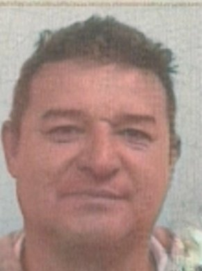

| Title | Photo | Resolution | Size | Diagnostic SDK 6.12.0 | Diagnostic SDK 6.12.1 | Diagnostic SDK 6.13.0 |
| ----- | ----- | ---------- | ---- | --------------------- | --------------------- | --------------------- |
| base64_001 |  | 320 x 430 | 29 KB | NoLive | NoLive | NoLive |
| base64_002 |  | 720 x 1280 | 44 KB | Live | NoLive | NoLive |
| base64_005 |  | 320 x 430 | 29 KB | NoLive | NoLive | NoLive |
| base64_006 |  | 720 x 1280 | 44 KB | Live | NoLive | NoLive |
| base64_009 |  | 720 x 1280 | 45 KB | Live | NoLive | NoLive |
| base64_010 |  | 720 x 1280 | 45 KB | Live | NoLive | NoLive |
| base64_011 |  | 720 x 1280 | 46 KB | Live | NoLive | NoLive |
| base64_012 |  | 720 x 1280 | 46 KB | Live | NoLive | NoLive |
| base64_013 |  | 720 x 1280 | 45 KB | Live | NoLive | NoLive |
| base64_014 |  | 720 x 1280 | 45 KB | Live | NoLive | NoLive |
| base64_015 |  | 720 x 1280 | 46 KB | Live | NoLive | NoLive |
| base64_016 |  | 720 x 1280 | 46 KB | Live | NoLive | NoLive |
| base64_017 |  | 720 x 1280 | 45 KB | Live | NoLive | NoLive |
| base64_018 |  | 720 x 1280 | 45 KB | Live | NoLive | NoLive |
| base64_019 |  | 720 x 1280 | 44 KB | Live | NoLive | NoLive |
| base64_020 |  | 720 x 1280 | 44 KB | Live | NoLive | NoLive |
| base64_021 |  | 720 x 1280 | 44 KB | Live | NoLive | NoLive |
| base64_022 |  | 720 x 1280 | 44 KB | Live | NoLive | NoLive |
| base64_023 |  | 720 x 1280 | 46 KB | Live | NoLive | NoLive |
| base64_024 |  | 720 x 1280 | 46 KB | Live | NoLive | NoLive |
| base64_025 |  | 720 x 1280 | 47 KB | Live | NoLive | NoLive |
| base64_026 |  | 720 x 1280 | 47 KB | Live | NoLive | NoLive |
| base64_027 |  | 720 x 1280 | 45 KB | Live | NoLive | NoLive |
| base64_028 |  | 720 x 1280 | 45 KB | Live | NoLive | NoLive |
| base64_029 |  | 720 x 1280 | 46 KB | Live | NoLive | NoLive |
| base64_030 |  | 720 x 1280 | 46 KB | Live | NoLive | NoLive |
| base64_031 |  | 720 x 1280 | 45 KB | Live | NoLive | NoLive |
| base64_032 |  | 720 x 1280 | 45 KB | Live | NoLive | NoLive |
| base64_033 |  | 720 x 1280 | 46 KB | Live | NoLive | NoLive |
| base64_034 |  | 720 x 1280 | 46 KB | Live | NoLive | NoLive |
| base64_035 |  | 720 x 1280 | 45 KB | Live | NoLive | NoLive |
| base64_036 |  | 720 x 1280 | 45 KB | Live | NoLive | NoLive |
| base64_037 |  | 720 x 1280 | 50 KB | Live | NoLive | NoLive |
| base64_038 |  | 720 x 1280 | 50 KB | Live | NoLive | NoLive |
| base64_039 |  | 720 x 1280 | 53 KB | Live | NoLive | NoLive |
| base64_040 |  | 720 x 1280 | 53 KB | Live | NoLive | NoLive |
| base64_041 |  | 720 x 1280 | 52 KB | Live | NoLive | NoLive |
| base64_042 |  | 720 x 1280 | 52 KB | Live | NoLive | NoLive |
| base64_043 |  | 720 x 1280 | 45 KB | Live | NoLive | NoLive |
| base64_044 |  | 720 x 1280 | 45 KB | Live | NoLive | NoLive |
| base64_045 |  | 720 x 1280 | 44 KB | Live | NoLive | NoLive |
| base64_046 |  | 720 x 1280 | 44 KB | Live | NoLive | NoLive |
| base64_047 |  | 720 x 1280 | 52 KB | Live | NoLive | NoLive |
| base64_048 |  | 720 x 1280 | 52 KB | Live | NoLive | NoLive |
| base64_049 |  | 720 x 1280 | 45 KB | Live | NoLive | NoLive |
| base64_050 |  | 720 x 1280 | 45 KB | Live | NoLive | NoLive |
| base64_051 |  | 720 x 1280 | 45 KB | Live | NoLive | NoLive |
| base64_052 |  | 720 x 1280 | 45 KB | Live | NoLive | NoLive |
| base64_053 |  | 720 x 1280 | 45 KB | Live | NoLive | NoLive |
| base64_054 |  | 720 x 1280 | 45 KB | Live | NoLive | NoLive |
| base64_055 |  | 720 x 1280 | 46 KB | Live | NoLive | NoLive |
| base64_056 |  | 720 x 1280 | 46 KB | Live | NoLive | NoLive |
| base64_057 |  | 720 x 1280 | 48 KB | Live | NoLive | NoLive |
| base64_058 |  | 720 x 1280 | 48 KB | Live | NoLive | NoLive |
| base64_059 |  | 720 x 1280 | 47 KB | Live | NoLive | NoLive |
| base64_060 |  | 720 x 1280 | 47 KB | Live | NoLive | NoLive |
| base64_061 |  | 720 x 1280 | 52 KB | Live | NoLive | NoLive |
| base64_062 |  | 720 x 1280 | 52 KB | Live | NoLive | NoLive |
| base64_063 |  | 720 x 1280 | 50 KB | Live | NoLive | NoLive |
| base64_064 |  | 720 x 1280 | 50 KB | Live | NoLive | NoLive |
| base64_065 |  | 720 x 1280 | 51 KB | Live | NoLive | NoLive |
| base64_066 |  | 720 x 1280 | 51 KB | Live | NoLive | NoLive |
| base64_067 |  | 720 x 1280 | 53 KB | Live | NoLive | NoLive |
| base64_068 |  | 720 x 1280 | 53 KB | Live | NoLive | NoLive |
| base64_069 |  | 720 x 1280 | 52 KB | Live | NoLive | NoLive |
| base64_070 |  | 720 x 1280 | 52 KB | Live | NoLive | NoLive |
| base64_071 |  | 291 x 390 | 25 KB | NoLive | NoLive | NoLive |
| base64_072 |  | 720 x 1280 | 43 KB | Live | NoLive | NoLive |
| base64_075 |  | 291 x 390 | 25 KB | NoLive | NoLive | NoLive |
| base64_076 |  | 720 x 1280 | 43 KB | Live | NoLive | NoLive |
| base64_079 |  | 291 x 390 | 25 KB | NoLive | NoLive | NoLive |
| base64_080 |  | 720 x 1280 | 42 KB | Live | NoLive | NoLive |
| base64_083 |  | 291 x 390 | 25 KB | NoLive | NoLive | NoLive |
| base64_084 |  | 720 x 1280 | 42 KB | Live | NoLive | NoLive |
| base64_087 |  | 291 x 390 | 25 KB | NoLive | NoLive | NoLive |
| base64_088 |  | 720 x 1280 | 44 KB | Live | NoLive | NoLive |
| base64_091 |  | 291 x 390 | 25 KB | NoLive | NoLive | NoLive |
| base64_092 |  | 720 x 1280 | 44 KB | Live | NoLive | NoLive |